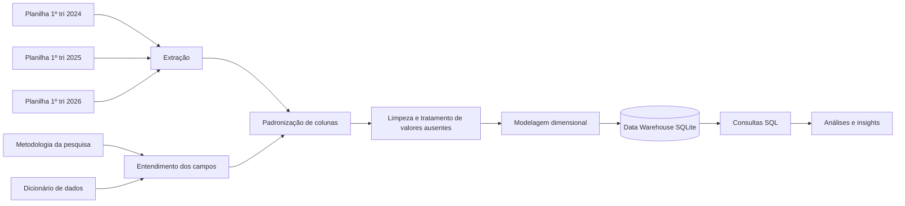

# Fluxo de integração dos dados

```mermaid
flowchart LR
    A1[Planilha 1º tri 2024] --> B[Extração]
    A2[Planilha 1º tri 2025] --> B
    A3[Planilha 1º tri 2026] --> B
    M1[Metodologia da pesquisa] --> C[Entendimento dos campos]
    M2[Dicionário de dados] --> C
    B --> D[Padronização de colunas]
    C --> D
    D --> E[Limpeza e tratamento de valores ausentes]
    E --> F[Modelagem dimensional]
    F --> G[(Data Warehouse SQLite)]
    G --> H[Consultas SQL]
    H --> I[Análises e insights]
```
